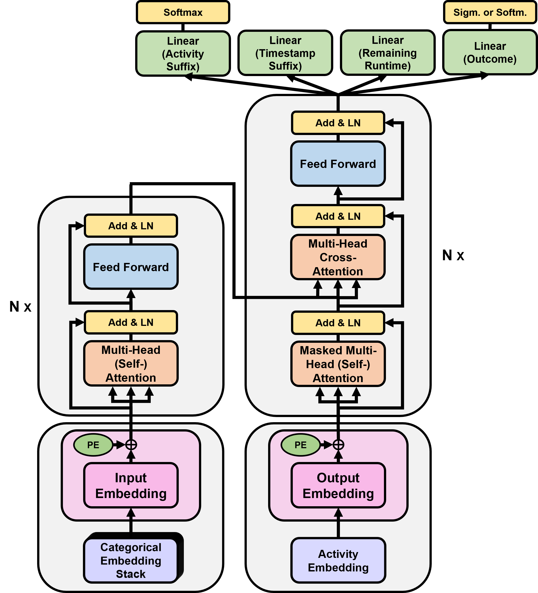

# SuTraN+



___

This repository accompanies the paper **"Unifying Multi-Task Process Prediction with Adaptive Loss Strategies in Transformers"**. SuTraN+, an encoder-decoder Transformer network for full-context-aware Predictive Process Monitoring (PPM), is the first network that unifies all four canonical PPM prediction tasks, by jointly predicting *activity suffixes*, *timestamp suffixes*, *remaining runtime*, and *case outcomes*. The codebase also implements the multi-task optimization strategies benchmarked in the paper (equal weighting, Uncertainty Weighting, Constrained Uncertainty Weighting, GradNorm, and PCGrad), together with strong single-task counterparts, all sharing the same preprocessing and model backbone.

- Strong emphasis on transparency and reproducibility: every preprocessing, training, and evaluation component is documented in-line to make adaptation and peer review straightforward.
- The experimental grid in the paper covers four real-life event logs. Three are publicly available (BPIC_17, BPIC_17_DR, BPIC_19); the fourth (BAC) is proprietary and cannot be distributed.
- CLI wrappers mirror the paper's setup so you can reproduce the reported runs or plug in your own data with minimal friction.

This repository builds on our earlier [SuffixTransformerNetwork project](https://github.com/BrechtWts/SuffixTransformerNetwork), released with *“SuTraN: an Encoder-Decoder Transformer for Full Context-Aware Suffix Prediction of Business Processes”* [[1]](#references). That work introduced the SuTraN encoder–decoder for jointly predicting activity suffix, timestamp suffix, and remaining runtime under Equal Weighting (EW). SuTraN+ extends the same backbone to jointly cover all four canonical PPM targets by adding outcome prediction (binary and multiclass) and systematically benchmarking adaptive multi-task optimization beyond the naïve EW baseline (UW, UW+, GradNorm, PCGrad). 
It also includes an in-repo implementation of our CaLenDiR training and evaluation framework [[2]](#references) (adapted from our [CaLenDiR-PPM codebase](https://github.com/BrechtWts/CaLenDiR-PPM)), which counters case-length distortion by weighting each case equally (rather than each instance), thereby preventing unusually long and often repetitive cases from spuriously dominating learning and reported metrics.
For fair comparisons, the repository also ships aligned single-task baselines, utilizing the same architectural SuTraN+ backbone, and thereby enabling clean multi- vs. single-task evaluation across all public logs and seeds used in the paper.

> For readers interested in detailed explanations of data preprocessing, train–test split procedures, tensor representation formats, and the autoregressive inference mechanics underlying suffix prediction, we refer to the original [SuTraN repository](https://github.com/BrechtWts/SuffixTransformerNetwork), whose README provides comprehensive walkthroughs and supplementary material. 
>
> Likewise, the [CaLenDiR-PPM repository](https://github.com/BrechtWts/CaLenDiR-PPM) contains in-depth documentation of the core CaLenDiR modules, including uniform case-based sampling, suffix-length-normalized loss functions, and case-based evaluation utilities, and how these extensions are integrated within the SuTraN pipeline, and by extension SuTraN+.


## Quick start
- Install dependencies: `pip install -r requirements.txt` and install a PyTorch build matching your hardware.
- Unzip the event logs at the repository root: `BPIC17_no_loop.zip`, `bpic17_with_loops.zip`, `BPIC19.zip` -> `*.csv` beside this README.
- Create the tensor datasets (one-time) for the public logs:
  - `python create_BPIC17_DR_data_multiclass.py`
  - `python create_BPIC17_OG_data_multiclass.py`
  - `python create_BPIC19_data.py`
- Run experiments via the wrappers in `TRAIN_EVAL_FUNCTIONALITY/` (examples below). Models automatically load the tensors and auxiliary pickle files produced in the previous step.


## Data preparation
The paper's preprocessing pipeline (chronological splits, outlier handling, feature encoding, leakage prevention) is implemented in `Preprocessing/` and reused by all experiments.

1. Unzip the public event logs in the repository root so the CSV files are named:
   - `BPIC17_no_loop.csv`
   - `bpic17_with_loops.csv`
   - `BPIC19.csv`
2. Run the data-creation scripts from the repository root:
   - BPIC_17_DR: `python create_BPIC17_DR_data_multiclass.py`
   - BPIC_17 (original): `python create_BPIC17_OG_data_multiclass.py`
   - BPIC_19: `python create_BPIC19_data.py`

Each script generates a folder at the root (matching `log_name`, e.g., `BPIC_17_DR`, `BPIC_17`, `BPIC_19`) containing tensor datasets (`train/val/test`) and the pickled mappings needed for model instantiation. The training/evaluation scripts reload everything automatically. The BAC log used in the paper is proprietary and cannot be shared; the public scripts above cover all reproducible experiments.


## Running experiments
The two wrappers in `TRAIN_EVAL_FUNCTIONALITY/` reproduce the paper's experiments end-to-end. Hyperparameters and per-log settings are stored in `log_configs.py` and `technique_configs.py`, aligned with the paper.

### Multi-task (SuTraN+ with MTO strategies)
```bash
python -m TRAIN_EVAL_FUNCTIONALITY.run_mto_experiment \
    --log_name BPIC_17 \
    --MTO_technique gradnorm \
    --seed 3
```
- `log_name`: `BPIC_17`, `BPIC_17_DR`, `BPIC_19` (BAC omitted for public use).
- `MTO_technique`: `equal_weighting`, `gradnorm`, `uw`, `uw_plus`, `pcgrad`.
- `seed`: any integer (paper uses 1-5).

### Single-task baselines (SST/NSST)
```bash
python -m TRAIN_EVAL_FUNCTIONALITY.run_singletask_experiment \
    --log_name BPIC_17_DR \
    --task activity_suffix \
    --seed 2
```
- `log_name`: `BPIC_17`, `BPIC_17_DR`, or `BPIC_19`.
- `task`: `activity_suffix`, `timestamp_suffix`, `remaining_runtime`, `binary_outcome`, `multiclass_outcome` (the wrapper enforces log/task compatibility; BPIC19 has no outcome target, BPIC17 variants only support multiclass outcomes).
- `seed`: experiment seed (1-5 in the paper).

Both wrappers stream progress to stdout and persist checkpoints/metrics exactly as in the publication, so sweeping log names, techniques/tasks, and seeds recreates the full experimental grid.


## Repository layout (selected)
- `Preprocessing/`: full preprocessing and tensor-creation pipeline shared by all experiments.
- `SuTraN/`: SuTraN+ model, training routines, and MTO-specific procedures (EW, UW, UW+, GradNorm, PCGrad).
- `SST_SuTraN/`: sequential single-task variants for activity/timestamp suffix prediction.
- `NSST_SuTraN/`: non-sequential single-task variants for remaining runtime and outcome prediction.
- `TRAIN_EVAL_FUNCTIONALITY/`: CLI wrappers and configs for running the experiment grid.
- `CaLenDiR_Utils/`: utilities for case-length de-noising and weighted metrics.
- `Utils/`: shared loss functions, callbacks, and schedulers.
- `create_BPIC17_DR_data_multiclass.py`, `create_BPIC17_OG_data_multiclass.py`, `create_BPIC19_data.py`: one-off data creation entry points for the public logs.
- `*.zip` event logs in the root: unzip here before running the data-creation scripts.


## Documentation and reproducibility
Every component is heavily documented to make the pipeline transparent, auditable, and easy to extend. The shared preprocessing, aligned single- and multi-task architectures, and the fixed hyperparameter grids in the configs mirror the paper, enabling faithful reproduction of the reported results and straightforward adaptation to new event logs. Contributions and comparisons are welcome; this repository is designed to foster reuse, collaboration, and progress in multi-task predictive process monitoring.

## References
[1] Wuyts, B., Vanden Broucke, S., & De Weerdt, J. (2024, October). SuTraN: an Encoder-Decoder Transformer for Full-Context-Aware Suffix Prediction of Business Processes. In 2024 6th International Conference on Process Mining (ICPM) (pp. 17-24). IEEE. https://doi.org/10.1109/ICPM63005.2024.10680671

[2] Wuyts, B., Vanden Broucke, S., & De Weerdt, J. (2025). CaLenDiR: Mitigating Case-Length Distortion in Deep-Learning-Based Predictive Process Monitoring. In Delgado, A., & Slaats, T. (Eds.), *Process Mining Workshops*, ICPM 2024, Lecture Notes in Business Information Processing, vol 533. Springer, Cham. https://doi.org/10.1007/978-3-031-82225-4_19